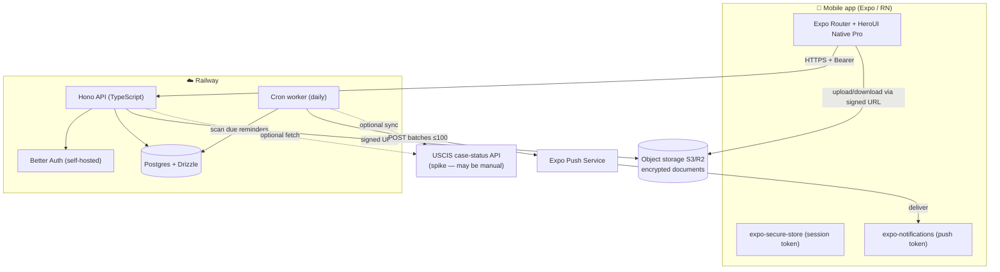

# Architecture — Immigration App

> Phase 3 artifact. Logical architecture, data flows, and the boundaries that keep sensitive PII safe. 2026-06-22.

## System overview

## Components

| Component | Tech | Responsibility |
|---|---|---|
| Mobile app | Expo SDK 56, RN 0.85, React 19, Expo Router, HeroUI Native Pro, Uniwind | All UI; holds only a short-lived session token + push token |
| API | Hono (TS) on Railway | All business logic, validation (Zod), authorization (every query scoped by `user_id`) |
| Auth | Better Auth (self-hosted) | Sessions/accounts; **we own the PII** (no third party holding immigration data) |
| Database | Postgres + Drizzle (`pg`) | Source of truth; see [DATA-MODEL.md](DATA-MODEL.md) |
| Object storage | S3 / Cloudflare R2 (encrypted) | Document files; Postgres stores only metadata + key |
| Cron worker | Railway cron (daily) | Sweep `reminders` → Expo Push; later: news ingestion + USCIS sync |
| Push | Expo Push Service | Delivers due-date reminders |

## Key data flows

**Auth:** app → `POST /auth/*` (Better Auth) → session token stored in `expo-secure-store`; sent as Bearer on every request; API authorizes per `user_id`.

**Document upload:** app → `POST /documents` (metadata) → API returns a **short-lived signed upload URL** → app uploads the file **directly** to encrypted object storage (never through the API). Download is the same in reverse. Keeps large files off the API and keeps the file bytes out of our logs.

**Reminders (verified pipeline):** daily Railway cron → query `reminders WHERE status='scheduled' AND remind_at <= now()` → chunk recipients into ≤100-message batches, throttle <600/sec → `POST exp.host/--/api/v2/push/send` → persist `push_ticket_id` → a second pass ~15 min later fetches receipts and disables dead `push_tokens`.

**Tracker:** manual receipt entry now; if the USCIS API spike succeeds, the cron also syncs `case_status_events`. Fallback is fully manual — the feature doesn't depend on the API.

## Security boundaries (non-negotiable)

- **No secret in the client bundle is secret** (verified) — all PII-access keys live only on Railway. The app holds only the user's own session + push tokens.
- **Every API query is scoped by the authenticated `user_id`.** A user can never read another user's applications, documents, cases, or deadlines.
- **TLS in transit; encryption at rest** (Postgres + object storage); A-number/SSN encrypted at the field level.
- **Account + data deletion/export** endpoints exist from day one (cascade + forum tombstone).

## Environments

| Env | Mobile | Backend |
|---|---|---|
| Development | Expo dev build + local/dev API | Railway dev service + dev Postgres |
| Preview | EAS internal distribution | Railway preview |
| Production | App Store / Play | Railway production |

EAS environment variables: three environments (development/preview/production), secret-type for build-time only. Railway env: `DATABASE_URL=${{Postgres.DATABASE_URL}}`, auth secrets, storage keys, Expo access token.

## Repo structure (decide at Phase 4)

Two options for where the Hono backend lives:
- **A — Monorepo** (`apps/mobile`, `apps/server`, `packages/shared` for Zod schemas/types shared client↔server). Best for type-safety end-to-end; restructures the current root.
- **B — Separate repos.** Simpler isolation; types duplicated or shared via a published package.

Recommendation: **A** (shared Zod types prevent client/server drift), decided when we set up the backend.

*Status: DRAFT.*
