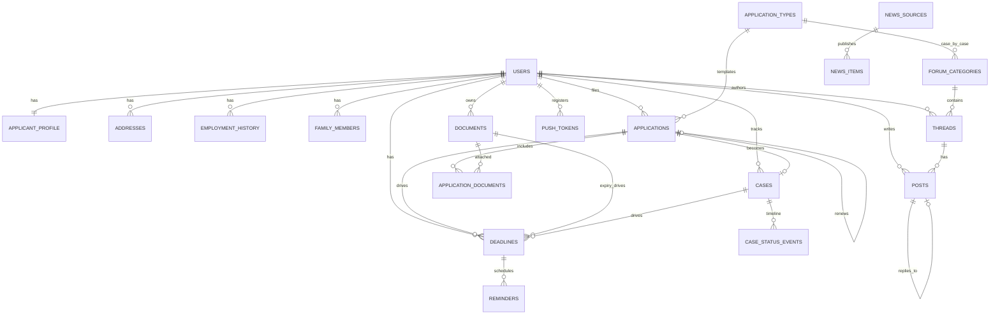

# Data Model — Immigration App

> Phase 3 artifact. The **complete** relational schema for all features (filing, tracker, calendar, reminders, forum, news), designed once so it never needs reworking as features ship incrementally.
> Postgres on Railway, Drizzle ORM (`pg` driver). Status: **REVIEWED** (database-reviewer pass applied 2026-06-22 — see Changelog).

## Design principles

1. **Retention by separation.** Durable, reusable data (`applicant_profile`, `addresses`, `employment_history`, `documents`) is owned by the **user**, never by a single application. Every new filing pre-fills from it. This is the moat.
2. **Renewals are first-class.** `applications.renews_application_id` self-references the prior filing (`ON DELETE SET NULL`), so "renew" clones the last application's answers + attached documents; the user only edits what changed.
3. **Dynamic forms via JSONB, not EAV.** Each `application_type` is an **immutable, versioned** row carrying a `form_schema` (JSONB); each `application` stores `answers` (JSONB) and pins the exact type row. New form version = new `application_types` row (never mutate). GIN index on `answers`.
4. **Explicit nullable FKs over polymorphic columns.** `deadlines` and `reports` point at their targets via separate real FKs (each enforced), never a polymorphic `target_id` that can't have an FK. A CHECK enforces "exactly/at-least one target."
5. **Deletion is built in.** User-owned rows cascade on account deletion (GDPR/CCPA + store requirement). Vault documents attached to a filing are `RESTRICT` (archive, don't destroy the filing record). Forum authorship anonymizes to a tombstone (`author_user_id` → NULL).
6. **`timestamptz` (UTC) everywhere; UUIDv7 for high-insert tables.** Encrypt A-number (and SSN if ever collected); document *files* live in encrypted object storage — only metadata in Postgres.

## Entity-relationship overview



## The retention loop (encoded in the schema)

```
document.expiry_date  ──►  deadline (kind=expiry)  ──►  reminders (push)
        ▲                                                      │
        │                                                      ▼
  vault updated  ◄──  application (renews_application_id)  ◄──  user returns to renew
        ▲                         │
        └──── reuses ◄── applicant_profile + addresses + employment + documents
```
First filing: tedious. Renewal: the wizard opens pre-filled from profile + vault + prior application — near one-tap.

---

## Drizzle schema

> Implementation splits this into `schema/{auth,profile,documents,applications,cases,calendar,forum,news}.ts` (many small files). Shown grouped. **Auth tables are managed by Better Auth**; app tables reference `authUser.id` (text). UUIDv7 is generated app-side at insert for high-insert tables (see notes).

```ts
import {
  pgTable, pgEnum, uuid, text, integer, boolean, timestamp, jsonb, date,
  index, uniqueIndex, primaryKey, check,
} from "drizzle-orm/pg-core";
import { sql } from "drizzle-orm";

// Managed by Better Auth (schema/auth.ts) — shown minimally so FKs resolve.
export const authUser = pgTable("auth_user", {
  id: text("id").primaryKey(),
  email: text("email").notNull().unique(),
  // ...Better Auth columns (name, emailVerified, createdAt, ...)
});

/* ───────────── Identity & reusable profile (retention core) ───────────── */

export const langEnum = pgEnum("language", ["en", "es", "zh", "hi", "tl", "vi", "other"]);

// 1:1 with auth_user. Durable identity reused by every filing.
export const applicantProfile = pgTable("applicant_profile", {
  userId: text("user_id").primaryKey()
    .references(() => authUser.id, { onDelete: "cascade" }),
  displayName: text("display_name"),                  // pseudonymous handle for the forum
  legalFirstName: text("legal_first_name"),           // required before filing (API gate)
  legalMiddleName: text("legal_middle_name"),
  legalLastName: text("legal_last_name"),
  dateOfBirth: date("date_of_birth"),
  countryOfBirth: text("country_of_birth"),
  nationality: text("nationality"),
  aNumberEnc: text("a_number_enc"),                   // ENCRYPTED (app-layer/pgcrypto)
  phone: text("phone"),
  preferredLanguage: langEnum("preferred_language").default("en"),
  createdAt: timestamp("created_at", { withTimezone: true }).defaultNow(),
  updatedAt: timestamp("updated_at", { withTimezone: true }).defaultNow().$onUpdate(() => sql`now()`),
});

export const addressTypeEnum = pgEnum("address_type", ["residential", "mailing", "physical"]);
export const addresses = pgTable("addresses", {
  id: uuid("id").defaultRandom().primaryKey(),
  userId: text("user_id").notNull().references(() => authUser.id, { onDelete: "cascade" }),
  type: addressTypeEnum("type").notNull(),
  line1: text("line1"), line2: text("line2"),
  city: text("city"), state: text("state"), postalCode: text("postal_code"),
  country: text("country").default("US"),
  fromDate: date("from_date"), toDate: date("to_date"),
  isCurrent: boolean("is_current").default(false),
  createdAt: timestamp("created_at", { withTimezone: true }).defaultNow(),
}, (t) => [
  index("addresses_user_idx").on(t.userId),
  // at most one current address per type per user
  uniqueIndex("addresses_one_current_idx").on(t.userId, t.type).where(sql`is_current = true`),
]);

export const employmentHistory = pgTable("employment_history", {
  id: uuid("id").defaultRandom().primaryKey(),
  userId: text("user_id").notNull().references(() => authUser.id, { onDelete: "cascade" }),
  employer: text("employer"), jobTitle: text("job_title"),
  fromDate: date("from_date"), toDate: date("to_date"),
  isCurrent: boolean("is_current").default(false),
  createdAt: timestamp("created_at", { withTimezone: true }).defaultNow(),
}, (t) => [
  index("employment_user_idx").on(t.userId),
  uniqueIndex("employment_one_current_idx").on(t.userId).where(sql`is_current = true`),
]);

export const familyMembers = pgTable("family_members", {
  id: uuid("id").defaultRandom().primaryKey(),
  userId: text("user_id").notNull().references(() => authUser.id, { onDelete: "cascade" }),
  relationship: text("relationship"),                 // spouse, child, parent...
  firstName: text("first_name"), lastName: text("last_name"),
  dateOfBirth: date("date_of_birth"),
  details: jsonb("details"),                          // shape validated by Zod at API (see L-3)
  createdAt: timestamp("created_at", { withTimezone: true }).defaultNow(),
}, (t) => [index("family_user_idx").on(t.userId)]);

/* ───────────── Document vault (retention engine) ───────────── */

export const docTypeEnum = pgEnum("doc_type", [
  "passport", "green_card", "ead", "i797_notice", "visa", "photo",
  "birth_certificate", "marriage_certificate", "supporting", "other",
]);
export const documents = pgTable("documents", {
  id: uuid("id").defaultRandom().primaryKey(),
  userId: text("user_id").notNull().references(() => authUser.id, { onDelete: "cascade" }),
  docType: docTypeEnum("doc_type").notNull(),
  fileKey: text("file_key"),                          // object-storage key; file encrypted at rest
  fileName: text("file_name"), mimeType: text("mime_type"), sizeBytes: integer("size_bytes"),
  issuedDate: date("issued_date"),
  expiryDate: date("expiry_date"),                    // drives expiry deadlines/reminders
  notes: text("notes"),
  archivedAt: timestamp("archived_at", { withTimezone: true }),  // soft-delete (keeps filing record)
  createdAt: timestamp("created_at", { withTimezone: true }).defaultNow(),
}, (t) => [
  index("documents_active_idx").on(t.userId).where(sql`archived_at IS NULL`),
  index("documents_expiry_idx").on(t.userId, t.expiryDate),
]);

/* ───────────── Filing (applications) ───────────── */

// Immutable, versioned rows — new form version = new row (never mutate).
export const applicationTypes = pgTable("application_types", {
  id: uuid("id").defaultRandom().primaryKey(),
  code: text("code").notNull(),                       // "I-90", "I-765"
  title: text("title").notNull(),
  category: text("category"),                         // renewal, initial...
  formVersion: text("form_version").notNull(),
  formSchema: jsonb("form_schema").notNull(),         // dynamic multi-step form definition
  docRequirements: jsonb("doc_requirements"),
  instructionsUrl: text("instructions_url"),
  isActive: boolean("is_active").default(true),
}, (t) => [uniqueIndex("app_types_code_ver_idx").on(t.code, t.formVersion)]);

export const appStatusEnum = pgEnum("application_status", [
  "draft", "ready", "submitted", "accepted", "rfe", "approved", "denied", "withdrawn",
]);
export const applications = pgTable("applications", {
  id: uuid("id").defaultRandom().primaryKey(),        // UUIDv7 app-side (appears in URLs)
  userId: text("user_id").notNull().references(() => authUser.id, { onDelete: "cascade" }),
  // points at the exact immutable versioned type row = source of truth for the form version
  applicationTypeId: uuid("application_type_id").notNull()
    .references(() => applicationTypes.id, { onDelete: "restrict" }),
  status: appStatusEnum("status").default("draft").notNull(),
  answers: jsonb("answers").default({}).notNull(),    // dynamic form data (NOT EAV)
  currentStep: integer("current_step").default(0),
  renewsApplicationId: uuid("renews_application_id")  // renewal chain — SET NULL, never CASCADE (C-2)
    .references((): any => applications.id, { onDelete: "set null" }),
  createdAt: timestamp("created_at", { withTimezone: true }).defaultNow(),
  updatedAt: timestamp("updated_at", { withTimezone: true }).defaultNow().$onUpdate(() => sql`now()`),
  submittedAt: timestamp("submitted_at", { withTimezone: true }),
}, (t) => [
  index("applications_user_status_idx").on(t.userId, t.status),
  index("applications_renews_idx").on(t.renewsApplicationId),
  index("applications_answers_gin").using("gin", t.answers),
]);

// M:N — one vault document backs many filings. Real composite PK (C-3); doc is RESTRICT (C-4).
export const applicationDocuments = pgTable("application_documents", {
  applicationId: uuid("application_id").notNull()
    .references(() => applications.id, { onDelete: "cascade" }),
  documentId: uuid("document_id").notNull()
    .references(() => documents.id, { onDelete: "restrict" }),
  role: text("role"),
  attachedAt: timestamp("attached_at", { withTimezone: true }).defaultNow(),
}, (t) => [primaryKey({ columns: [t.applicationId, t.documentId] })]);

/* ───────────── Tracker (cases) ───────────── */

export const caseSourceEnum = pgEnum("case_source", ["manual", "uscis_api"]);
export const cases = pgTable("cases", {
  id: uuid("id").defaultRandom().primaryKey(),
  userId: text("user_id").notNull().references(() => authUser.id, { onDelete: "cascade" }),
  applicationId: uuid("application_id")              // nullable — can track a case filed elsewhere
    .references(() => applications.id, { onDelete: "set null" }),
  receiptNumber: text("receipt_number"),
  formCode: text("form_code"),
  currentStatus: text("current_status"),
  currentStatusText: text("current_status_text"),
  source: caseSourceEnum("source").default("manual"),
  lastSyncedAt: timestamp("last_synced_at", { withTimezone: true }),
  openedAt: timestamp("opened_at", { withTimezone: true }).defaultNow(),
}, (t) => [
  index("cases_user_idx").on(t.userId),
  // partial unique — NULL receipts don't collide (H-2)
  uniqueIndex("cases_user_receipt_idx").on(t.userId, t.receiptNumber).where(sql`receipt_number IS NOT NULL`),
]);

export const caseStatusEvents = pgTable("case_status_events", {
  id: uuid("id").defaultRandom().primaryKey(),        // UUIDv7 app-side
  caseId: uuid("case_id").notNull().references(() => cases.id, { onDelete: "cascade" }),
  status: text("status"), statusText: text("status_text"),
  occurredAt: timestamp("occurred_at", { withTimezone: true }).notNull(),  // default to now() at insert (M-7)
  raw: jsonb("raw"),
  createdAt: timestamp("created_at", { withTimezone: true }).defaultNow(),
}, (t) => [index("case_events_case_idx").on(t.caseId, t.occurredAt)]);

/* ───────────── Calendar, reminders, devices ───────────── */

export const deadlineKindEnum = pgEnum("deadline_kind", [
  "file_by", "expiry", "biometrics", "rfe_response", "interview", "custom",
]);
export const deadlineStatusEnum = pgEnum("deadline_status", ["upcoming", "done", "dismissed", "overdue"]);
export const deadlines = pgTable("deadlines", {
  id: uuid("id").defaultRandom().primaryKey(),
  userId: text("user_id").notNull().references(() => authUser.id, { onDelete: "cascade" }),
  applicationId: uuid("application_id").references(() => applications.id, { onDelete: "cascade" }),
  caseId: uuid("case_id").references(() => cases.id, { onDelete: "cascade" }),
  documentId: uuid("document_id").references(() => documents.id, { onDelete: "cascade" }),
  kind: deadlineKindEnum("kind").notNull(),
  title: text("title").notNull(),
  dueAt: timestamp("due_at", { withTimezone: true }).notNull(),
  allDay: boolean("all_day").default(true),
  status: deadlineStatusEnum("status").default("upcoming").notNull(),
  notes: text("notes"),
  createdAt: timestamp("created_at", { withTimezone: true }).defaultNow(),
}, (t) => [
  // hot path: a user's upcoming agenda (H-4)
  index("deadlines_upcoming_idx").on(t.userId, t.dueAt).where(sql`status = 'upcoming'`),
  // every deadline must reference something, unless user-created (L-4)
  check("deadlines_has_target", sql`application_id IS NOT NULL OR case_id IS NOT NULL OR document_id IS NOT NULL OR kind = 'custom'`),
]);

export const reminderStatusEnum = pgEnum("reminder_status", ["scheduled", "sent", "failed", "cancelled"]);
export const reminders = pgTable("reminders", {
  id: uuid("id").defaultRandom().primaryKey(),        // UUIDv7 app-side
  deadlineId: uuid("deadline_id").notNull().references(() => deadlines.id, { onDelete: "cascade" }),
  userId: text("user_id").notNull().references(() => authUser.id, { onDelete: "cascade" }),
  remindAt: timestamp("remind_at", { withTimezone: true }).notNull(),
  leadLabel: text("lead_label"),                      // "30 days before"
  channel: text("channel").default("push"),
  status: reminderStatusEnum("status").default("scheduled").notNull(),
  pushTicketId: text("push_ticket_id"),               // for Expo receipt lookup
  sentAt: timestamp("sent_at", { withTimezone: true }),
}, (t) => [
  // THE cron hot path — covering partial index (C-1, H-3). Verify generated SQL has the WHERE clause;
  // if the Drizzle version lacks index .where(), create via raw migration.
  index("reminders_due_idx").on(t.remindAt, t.userId).where(sql`status = 'scheduled'`),
]);

export const platformEnum = pgEnum("platform", ["ios", "android"]);
export const pushTokens = pgTable("push_tokens", {
  id: uuid("id").defaultRandom().primaryKey(),
  userId: text("user_id").notNull().references(() => authUser.id, { onDelete: "cascade" }),
  expoToken: text("expo_token").notNull(),
  platform: platformEnum("platform"),
  deviceName: text("device_name"),
  lastSeenAt: timestamp("last_seen_at", { withTimezone: true }).defaultNow(),
  disabledAt: timestamp("disabled_at", { withTimezone: true }),  // set when a receipt says invalid
}, (t) => [
  uniqueIndex("push_tokens_token_idx").on(t.expoToken),
  index("push_tokens_user_idx").on(t.userId),         // cron JOIN (M-6)
]);

/* ───────────── Community (forum) ───────────── */

export const forumCategories = pgTable("forum_categories", {
  id: uuid("id").defaultRandom().primaryKey(),
  slug: text("slug").notNull(),
  title: text("title").notNull(),
  description: text("description"),
  applicationTypeId: uuid("application_type_id")      // "case-by-case" categories
    .references(() => applicationTypes.id, { onDelete: "set null" }),
  sortOrder: integer("sort_order").default(0),
  isActive: boolean("is_active").default(true),
}, (t) => [uniqueIndex("forum_cat_slug_idx").on(t.slug)]);

export const threadStatusEnum = pgEnum("thread_status", ["open", "locked", "hidden", "deleted"]);
export const threads = pgTable("threads", {
  id: uuid("id").defaultRandom().primaryKey(),
  categoryId: uuid("category_id").notNull().references(() => forumCategories.id, { onDelete: "restrict" }),
  authorUserId: text("author_user_id").references(() => authUser.id, { onDelete: "set null" }), // tombstone
  title: text("title").notNull(),
  body: text("body"),
  status: threadStatusEnum("status").default("open").notNull(),
  isPinned: boolean("is_pinned").default(false),
  replyCount: integer("reply_count").default(0),      // denormalized; trigger in impl (H-5)
  lastActivityAt: timestamp("last_activity_at", { withTimezone: true }).defaultNow(),
  createdAt: timestamp("created_at", { withTimezone: true }).defaultNow(),
}, (t) => [
  index("threads_category_activity_idx").on(t.categoryId, t.lastActivityAt),
  check("threads_reply_count_nonneg", sql`reply_count >= 0`),
]);

export const postStatusEnum = pgEnum("post_status", ["visible", "hidden", "deleted"]);
export const posts = pgTable("posts", {
  id: uuid("id").defaultRandom().primaryKey(),        // UUIDv7 app-side
  threadId: uuid("thread_id").notNull().references(() => threads.id, { onDelete: "cascade" }),
  authorUserId: text("author_user_id").references(() => authUser.id, { onDelete: "set null" }), // tombstone
  parentPostId: uuid("parent_post_id").references((): any => posts.id, { onDelete: "set null" }),
  body: text("body").notNull(),
  status: postStatusEnum("status").default("visible").notNull(),
  createdAt: timestamp("created_at", { withTimezone: true }).defaultNow(),
}, (t) => [index("posts_thread_idx").on(t.threadId, t.createdAt)]);

export const reportStatusEnum = pgEnum("report_status", ["open", "reviewed", "actioned"]);
export const reports = pgTable("reports", {            // moderation from day one; explicit FKs (H-6)
  id: uuid("id").defaultRandom().primaryKey(),
  threadId: uuid("thread_id").references(() => threads.id, { onDelete: "cascade" }),
  postId: uuid("post_id").references(() => posts.id, { onDelete: "cascade" }),
  reporterUserId: text("reporter_user_id").references(() => authUser.id, { onDelete: "set null" }),
  reason: text("reason"),
  status: reportStatusEnum("status").default("open"),
  createdAt: timestamp("created_at", { withTimezone: true }).defaultNow(),
}, (t) => [
  check("reports_single_target", sql`(thread_id IS NOT NULL) <> (post_id IS NOT NULL)`),
]);

/* ───────────── News ───────────── */

export const newsSourceKindEnum = pgEnum("news_source_kind", ["rss", "api", "scrape"]);
export const newsSources = pgTable("news_sources", {
  id: uuid("id").defaultRandom().primaryKey(),
  name: text("name").notNull(),
  url: text("url"), feedUrl: text("feed_url"),
  kind: newsSourceKindEnum("kind").default("rss"),
  isActive: boolean("is_active").default(true),
  lastFetchedAt: timestamp("last_fetched_at", { withTimezone: true }),
});

export const newsItems = pgTable("news_items", {
  id: uuid("id").defaultRandom().primaryKey(),        // UUIDv7 app-side
  sourceId: uuid("source_id").notNull().references(() => newsSources.id, { onDelete: "cascade" }),
  externalId: text("external_id"),                   // primary dedupe key (L-5)
  title: text("title").notNull(),
  url: text("url").notNull(),
  summary: text("summary"), body: text("body"),
  tags: text("tags").array(),                        // flat string list → faster @> than JSONB (M-4)
  publishedAt: timestamp("published_at", { withTimezone: true }),
  fetchedAt: timestamp("fetched_at", { withTimezone: true }).defaultNow(),
  isPublished: boolean("is_published").default(false),
}, (t) => [
  uniqueIndex("news_source_external_idx").on(t.sourceId, t.externalId).where(sql`external_id IS NOT NULL`),
  uniqueIndex("news_url_idx").on(t.url),             // secondary guard
  index("news_published_idx").on(t.publishedAt),
  index("news_tags_gin").using("gin", t.tags),
]);

/* ───────────── Compliance ───────────── */

export const auditLog = pgTable("audit_log", {           // who accessed/changed sensitive PII
  id: uuid("id").defaultRandom().primaryKey(),
  actorUserId: text("actor_user_id"),
  action: text("action").notNull(),                  // view | create | update | delete | export
  entityType: text("entity_type"),
  entityId: uuid("entity_id"),                        // uuid, not text (H-7)
  ip: text("ip"),
  createdAt: timestamp("created_at", { withTimezone: true }).defaultNow(),
}, (t) => [
  index("audit_actor_idx").on(t.actorUserId, t.createdAt),
  index("audit_entity_idx").on(t.entityType, t.entityId, t.createdAt),  // "who touched doc X" (H-7)
]);
```

## Indexing & performance notes

- **Cron hot path:** `reminders_due_idx` is a **covering partial index** on `(remind_at, user_id) WHERE status='scheduled'` — the daily sweep + push-token JOIN both ride it. Confirm the generated DDL includes `WHERE (status = 'scheduled')`; if the Drizzle version doesn't emit it, use a raw `CREATE INDEX ... WHERE` migration.
- **Calendar:** `deadlines_upcoming_idx` partial index serves the agenda; we dropped the unused global `(due_at, status)` index (no global job exists).
- **Filing:** `applications(user_id, status)` for the dashboard; GIN on `answers` for form queries.
- **Tracker / forum / news:** timeline, feed, and dedup indexes as annotated inline.
- **PKs:** high-insert tables (`reminders`, `case_status_events`, `posts`, `news_items`) use **app-generated UUIDv7** at insert to avoid B-tree fragmentation from random v4.

## PII & security notes (threat-model applied — see [spikes/threat-model.md](spikes/threat-model.md))

Audience includes DACA/asylum/TPS holders → the structured PII set is a **subpoena/ICE-request target, not just a breach risk.** Posture: *minimize what exists, encrypt what remains, require lawful process.*

- **Field-level encryption (app-layer AES-256-GCM)** over the full re-identifying set — **not just A-number**: legal name(s), DOB, country_of_birth, nationality, A-number, phone, address line1/line2/postal, employment employer/title, family member names/DOB/details, `documents.fileName`/`notes`, and `cases.receiptNumber`. Plaintext name/DOB/country was the real breach payload.
- **Key management: external KMS (AWS KMS / Cloudflare) + envelope encryption + per-user data keys** — NOT pgcrypto with the key in `DATABASE_URL` (a leaked backup or a subpoena on the DB host would expose everything). Per-user keys enable **crypto-shredding** on deletion.
- **Encrypted-column search:** HMAC **blind index** for `receipt_number` (deterministic keyed hash in a sibling column, e.g. `receipt_number_bidx`) so lookups work without decrypting. Encrypted DOB/country **cannot be indexed** → **no plaintext "cases like yours" cohort feature in v1** (derive coarse non-PII buckets like age_band/form_code at write time if ever needed).
- **Documents: metadata-only for v1** (`file_key` NULL) — doc_type + expiry only fully powers the reminder/retention loop without holding immigration files. Encrypted file storage deferred until a feature needs the bytes.
- **Right-to-erasure vs `RESTRICT` (ship-blocker — RESOLVED):** account deletion does **crypto-shredding** (destroy the user's data keys) + scoped retention, not row-preservation of PII. The filing record survives as a non-PII shell; the PII becomes unrecoverable. Satisfies GDPR/CCPA erasure AND referential integrity AND app-store in-app deletion.
- **Government-data-request posture:** require valid subpoena/court order (metadata) or judicial warrant (content); **no voluntary ICE/DHS cooperation** absent lawful process; notify users when legally permitted; transparency stance; documented legal-hold runbook. (Owned with counsel — see DECISIONS.)
- **IP logging:** `audit_log.ip` retained **short-TTL only** (sensitive for this population); purge audit rows on a schedule (~12 months).
- **Data minimization:** collect only fields the I-765 PDF renders; **lazy PII collection** (gather DOB/country at the filing step, not signup → abandoned accounts hold near-zero PII); **never collect SSN**; A-number optional until PDF export; forum **fully pseudonymous** (only `display_name`, never legal name, touches forum tables — enforced at the API).
- **Authorization:** single API scopes every query by `user_id`. Postgres RLS not required for v1 (one trusted API, no direct client DB access).

## Resolved (Phase 0) & open questions

- ✅ **USCIS case-status API → NO-GO for v1** (org-vetted/representational, not consumer lookup). Tracker is **manual-first** behind a `CaseStatusProvider` seam; `cases.source='manual'`, user-logged `case_status_events`. Future API swap-in needs no schema change. See [spikes/uscis-api.md](spikes/uscis-api.md).
- ✅ **Documents → metadata-only for v1** (`file_key` NULL).
- ✅ **Right-to-erasure vs `RESTRICT` → resolved via crypto-shredding** (see PII notes).
- [ ] At backend implementation: add the blind-index column(s) (`receipt_number_bidx`) and finalize the encrypted-field set in the Drizzle schema.
- [ ] **`reply_count` trigger vs subquery** — decide at forum implementation (v1.1).

## Changelog

- **2026-06-22 — database-reviewer pass applied.** Fixed: partial-index syntax + covering reminder index (C-1/H-3), self-FK `SET NULL` (C-2), real composite PK on `application_documents` (C-3), document `RESTRICT` + `archivedAt` soft-delete (C-4), all FKs wired with `onDelete` (H-1), partial-unique receipt numbers (H-2), partial upcoming-deadline index + dropped unused index (H-4), `reply_count` CHECK (H-5), `reports` explicit FKs + single-target CHECK (H-6), audit entity index + uuid `entity_id` (H-7), immutable versioned `application_types` instead of composite version FK (M-1), `isCurrent` partial-unique guards (M-3), `tags` → `text[]` + GIN (M-4), forum/news enums (M-8), `pushTokens.userId` index (M-6), `occurred_at NOT NULL` (M-7), `$onUpdate` on `updatedAt` (L-2), UUIDv7 note (L-1), deadline target CHECK (L-4), news dedup on `(source_id, external_id)` (L-5).

- **2026-06-22 — Phase 0 threat-model applied.** Encryption widened from A-number to the full structured-PII set; external KMS + per-user keys (crypto-shred); HMAC blind-index for `receipt_number`; metadata-only vault confirmed; erasure-vs-`RESTRICT` resolved via crypto-shredding; short-TTL IP; data-minimization (lazy collection, never SSN, pseudonymous forum). USCIS API NO-GO → manual-first tracker behind a `CaseStatusProvider` seam. See [spikes/](spikes/).

*Status: REVIEWED + Phase-0 hardened — ready to implement at Phase 5 (Backend), encryption layer included.*
